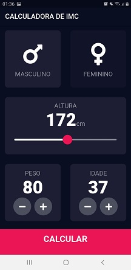
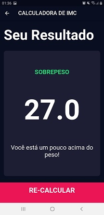

# APP CALCULADORA IMC

Aplicativo desenvolvido em Flutter com os conhecimentos adquiridos nas aulas da professora Angela Yu na Udemy. Organizado por componentes e telas, foram utilizados os mais variados widgets, funções e recursos de formatação para chegar ao resultado final. É uma calculadora de IMC (índice de massa corpórea) que avalia o grau de peso, sobrepeso e obesidade. 

 

 